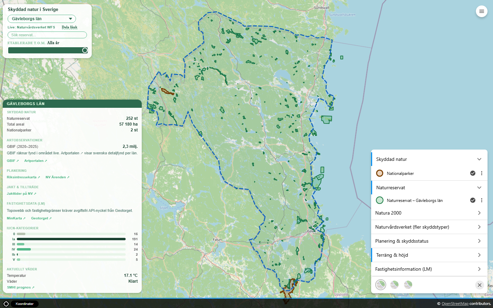
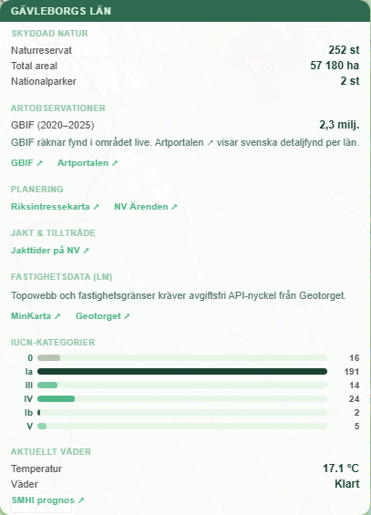
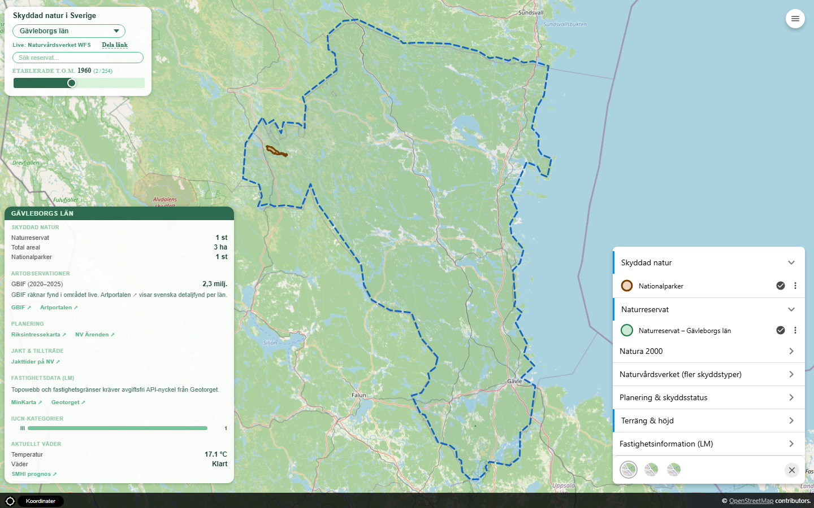
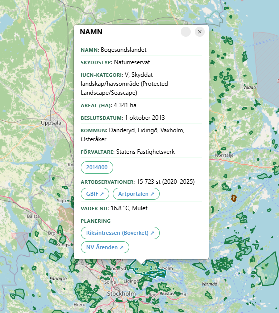

# Naturkarta — Skyddad natur

**[Öppna kartan →](https://ulfboge.github.io/svensk-naturkarta-origo-demo/)**

A portfolio web GIS application showing Swedish nature conservation data across **all 21 counties** using [Origo Map](https://github.com/origo-map/origo) — the open-source GIS framework used by Swedish municipalities and county administrative boards (_länsstyrelser_).

> The application mimics a realistic Swedish municipal/regional nature conservation GIS portal.

---

## Screenshots


*5 993 naturreservat och 31 nationalparker i alla 21 län. Dropdown, reservatsökning, tidslinje-slider (1908–2026) och statistikpanel.*


*Statistikpanel (nedre vänster): skyddad natur, GBIF-artobs, planering, jakt & tillträde, IUCN-diagram och SMHI-väder — uppdateras vid länsbyte och tidslinje.*


*Datumslidern visar etablerade naturreservat och nationalparker t.o.m. valt år. Statistik och IUCN-fördelning följer med.*


*Klickbar popup: namn, skyddstyp, IUCN, areal, beslutsdatum, NV-länk, GBIF, Artportalen, planering och SMHI-väder.*

---

## What it shows

**5 993 naturreservat** och **31 nationalparker** i alla 21 svenska län:

| Län | Naturreservat | Nationalparker |
|---|---|---|
| Stockholms | 383 | 3 |
| Södermanlands | 196 | — |
| Uppsala | 201 | 1 |
| Östergötlands | 329 | — |
| Västra Götalands | 545 | 4 |
| Skåne | 391 | 3 |
| Blekinge | 126 | — |
| Dalarnas | 420 | 3 |
| Gotlands | 165 | 1 |
| Gävleborgs | 252 | 2 |
| Hallands | 212 | — |
| Jämtlands | 270 | 1 |
| Jönköpings | 186 | 1 |
| Kalmar | 214 | 2 |
| Kronobergs | 154 | 1 |
| Norrbottens | 529 | 8 |
| Värmlands | 243 | — |
| Västerbottens | 476 | 1 |
| Västernorrlands | 239 | 1 |
| Västmanlands | 138 | 1 |
| Örebro | 324 | 2 |

Nationalparker filtreras per län via `LAN`-fältet (parkar i flera län, t.ex. Färnebofjärden, räknas i varje berört län).

**WMS-lager (rikstäckande):**

| Lager | Källa | Typ |
|---|---|---|
| Natura 2000 SCI — Habitatdirektivet | Naturvårdsverket | WMS |
| Natura 2000 SPA — Fågeldirektivet | Naturvårdsverket | WMS |
| Biotopskyddsområden | Naturvårdsverket | WMS |
| Djur- och växtskyddsområden | Naturvårdsverket | WMS |
| Vattenskyddsområden | Naturvårdsverket | WMS |
| Naturminnen (ytor + punkter) | Naturvårdsverket | WMS |
| Kommunala naturreservat | Naturvårdsverket | WMS |
| Tillträdesförbud | Naturvårdsverket | WMS |
| Interimistiska förbud | Naturvårdsverket | WMS |
| Beslutsstatus, Naturvårdsområden | Naturvårdsverket | WMS |
| Riksintressen | Boverket | WMS |

---

## Key features

- **County dropdown** — 21 län + Hela Sverige; zoomar kartan och visar länsspecifika naturreservat
- **Nationalparker per län** — dolda som standard, filtreras geografiskt vid länval
- **Tidslinje-slider (1908–2026)** — filtrerar naturreservat och nationalparker efter etableringsår; statistik och IUCN-diagram uppdateras live
- **Reservatsökning** — autocomplete per valt län, zoom till valt objekt
- **Statistikpanel** — antal/areal, nationalparker, GBIF-artobs, planering, jakt, IUCN-stapeldiagram, SMHI-väder
- **Popup** — NV, GBIF, Artportalen (NVRID), Boverket riksintressen, SMHI punktprognos
- **Tre bakgrundskartor** — OSM, OpenTopoMap, Lantmäteriet Topowebb
- **Terräng & höjd** — Lantmäteriets Markhöjdmodell NH (terrängskuggning + lutning som WMS-overlay)

---

## Tech stack

| What | How |
|---|---|
| Map framework | [Origo Map v2.10](https://github.com/origo-map/origo/releases/tag/v2.10.0) |
| Rendering engine | OpenLayers 9 (bundled inside Origo) |
| Dev server | `python -m http.server` — no build step |
| Configuration | `public/config/origo.json` |
| Projection | EPSG:3857 display, coordinate readout in SWEREF99 TM + WGS84 |
| Data pipeline | Python + fiona/pyshp + pyproj — shapefile → WGS84 GeoJSON |

**No npm. No bundler. No backend.**

---

## Project structure

```
public/
  config/origo.json          ← layers, styles, controls
  data/
    naturreservat-*.geojson  ← 21 län (5 993 NR totalt)
    nationalparker-alla.geojson
  src/style.css
  index.html                 ← county selector, search, stats, timeline slider
scripts/
  capture_screenshots.py     ← Playwright — uppdatera README-bilder
backfill_dates.py            ← fyll i URSPR_BESLUTSDATUM från shapefile (pyshp)
extract_date_utils.py
```

---

## How to run

```powershell
git clone https://github.com/ulfboge/svensk-naturkarta-origo-demo
cd svensk-naturkarta-origo-demo
python -m http.server 3000 --directory public
# Open http://localhost:3000
```

### QGIS Server (WFS pilot, valfritt)

Kräver Docker Desktop. Se [QGIS_SERVER_PLAN.md](QGIS_SERVER_PLAN.md).

```powershell
docker compose up -d
python scripts/dev_server.py
# Lager: "Naturreservat Gavleborg (WFS live)" i lagerpanelen
```

### Uppdatera screenshots

```powershell
python -m http.server 3000 --directory public
# annan terminal:
pip install playwright && python -m playwright install chromium
python scripts/capture_screenshots.py
```

### Backfill etableringsdatum

```powershell
python backfill_dates.py
# Kräver E:/NR/NR/NR_polygon.shp och E:/NP/NP/NP_polygon.shp
```

---

## Data sources & licences

| Dataset | Leverantör | Licens |
|---|---|---|
| Naturreservat, Nationalparker, Natura 2000 | [Naturvårdsverket](https://www.naturvardsverket.se/om-oss/oppna-data-och-apier/) | CC0 |
| Artobservationer | [GBIF](https://www.gbif.org) / [Artportalen](https://www.artportalen.se) | CC BY |
| Topowebb | [Lantmäteriet](https://opendata.lantmateriet.se/) | CC BY |
| Bakgrundskarta | [OpenStreetMap](https://www.openstreetmap.org/) contributors | ODbL |

---

## Roadmap

### ✅ Klart

- [x] 5 993 naturreservat i alla 21 län + 31 nationalparker
- [x] 11+ WMS-lager (Natura 2000, biotopskydd, planering, jakt m.m.)
- [x] County dropdown, sök, statistikpanel, GBIF, SMHI, Artportalen
- [x] Tidslinje-slider med live statistik och IUCN-diagram
- [x] Nationalparker dolda som default, filtrerade per län och år
- [x] Etableringsdatum backfillade (pyshp)
- [x] README-screenshots (inkl. tidslinje)

### Möjliga nästa steg

- [x] Höjddata — Markhöjdmodell NH (terrängskuggning + lutning, WMS)
- [x] QGIS Server — WFS-pilot (Gävleborg, Docker + `scripts/dev_server.py`)
- [ ] Lazy-load GeoJSON per län vid aktivering (prestanda)
- [ ] SWEREF99 TM som visningsprojektion (fas 4)

---

## Useful references

- [Origo Map documentation](https://github.com/origo-map/origo/wiki)
- [Naturvårdsverket öppna data](https://www.naturvardsverket.se/om-oss/oppna-data-och-apier/)
- [Sessionanteckningar 2026-05-21](docs/05_session_2026-05-21.md)

---

## Licence

Code: [MIT](LICENSE)  
Geodata: see Data sources section above.
